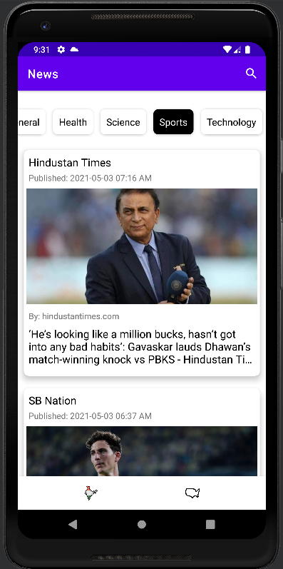
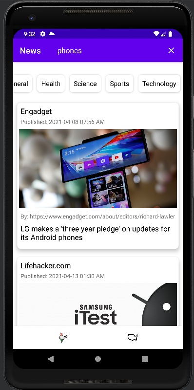

# News App
Obvious Gallery is an gallery app that shows the latest and greatest images from NASA

India tab             |  US tab          |  Category selection | Search query
:-------------------------:|:-------------------------:|:-------------------------:|:-------------------------:|
  |    |   |  

## Getting Started
### Setup
Clone or download the repo 

### Open and Run Project in Android Studio
Open the project in Android Studio and click RUN. Simple.

### Features
 - Implemented country specific news from India and US
 - Implemented country selection in the bottom navigation bar
 - Implemented news feed updation on category selection and search query
 - Category selection gets the news from the 'Top Headlines' API
 - Search gets the news from the 'Everything' API
 - Added unit test cases for the News Feed view model class

### Libraries
1. Dagger 2
2. Retrofit
2. Glide
2. RxJava
3. Mockito

### Android Version Targeting
Works on Marshmallow and above

### Important points
1. Scrolling too fast will result in the API throwing Too Many Request errors. So please scroll slowly.
2. There might be few minor bugs

### Todo

 - More UI Tests
 - Add Night Mode
 - Add view pager to maintain state
 - Live internet check

### License

MIT
